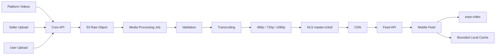

# 20. Video Delivery Optimization Spec

Цель: сделать видео в ленте быстрым при первом старте и плавным при свайпе за счёт правильной обработки медиа, adaptive bitrate delivery, предзагрузки ближайших роликов и ограниченного локального кэша.

Документ дополняет [`16-video-platform-spec.md`](16-video-platform-spec.md), где уже описаны HLS, варианты качества и базовая структура хранения.

---

## 1. Проблема

Сейчас клиент получает `item.video.url` и передаёт его напрямую в `expo-video`. В ленте есть только mount-based preload ближайшего элемента, но нет отдельной стратегии для:

- генерации нескольких качеств видео;
- выбора качества по сети;
- CDN/HLS delivery;
- локального кэша между запусками приложения;
- ограничений по трафику, памяти и диску.

Также нужно учитывать разные источники видео:

- platform-managed videos: видео самой платформы, которые сейчас могут лежать как статические файлы в клиентском/public слое;
- seller/company videos: видео компаний и фабрик для рекламы товаров, с обязательной привязкой к товарам;
- user-generated videos: будущие пользовательские видео, для которых ещё нет интерфейсов и реализации.

Из-за этого пользователь может ждать загрузку при каждом новом ролике, особенно на слабой сети или при повторном открытии приложения.

---

## 2. Целевая архитектура



Ключевой принцип: клиент не должен скачивать тяжёлый оригинал. Feed должен отдавать готовый playback asset: HLS master playlist для production или оптимизированный progressive MP4 fallback.

---

## 3. Content Sources

### 3.1 Platform-Managed Videos

Это видео, которые загружает команда платформы: onboarding, промо, подборки, рекламные ролики маркетплейса, стартовый контент для пустой ленты.

Текущий вариант “лежат в public на клиенте” можно оставить только как временный dev/demo режим. Для production такие видео должны пройти тот же processing pipeline, что и остальные:

- завести запись `video_asset`/`content_video` в backend;
- загрузить raw source в S3/MinIO;
- прогнать через Go media service;
- получить `poster`, `thumbnail`, HLS variants;
- отдавать через Feed API как обычный `ready` asset;
- пометить source type как `platform`.

Причина: если оставить platform videos внутри клиента, приложение станет тяжелее, обновление контента потребует релиза, а качество/кэш/CDN будут отличаться от остальных видео.

### 3.2 Seller/Company Product Videos

Это основной commerce-driven сценарий. Видео загружает компания/фабрика, чтобы показать товар и привести пользователя к покупке.

Требования:

- upload доступен только авторизованной компании с нужными правами;
- видео должно быть связано минимум с одним товаром или кампанией, если это рекламный формат;
- product linking хранится отдельно от media asset, чтобы один media asset не смешивал storage и commerce metadata;
- в feed ranking такие видео могут учитывать качество продавца, релевантность товара, availability, цену и конверсию;
- модерация обязательна до публикации или перед попаданием в публичную ленту.

### 3.3 User-Generated Videos

Это будущий слой: обзоры, распаковки, отзывы, короткие видео от покупателей или creators. Сейчас интерфейсов нет, но архитектуру лучше заложить сразу.

Требования:

- source type `user`;
- отдельные права на upload и публикацию;
- более строгая moderation policy;
- возможность привязки к товару как review/proof, но не обязательно как seller promotion;
- отдельный статус доверия: verified buyer, creator, обычный пользователь;
- возможность отключить UGC из MVP-ленты, не ломая общий media pipeline.

### 3.4 Unified Content Model

Все источники должны сходиться в единую модель playback asset. Различаться должны ownership, moderation rules и business metadata, а не способ доставки видео.

Минимальные поля для backend:

```ts
type VideoSourceType = 'platform' | 'seller' | 'user';
type VideoPurpose = 'feed' | 'product_demo' | 'ad' | 'review' | 'onboarding';

interface VideoContent {
  id: string;
  sourceType: VideoSourceType;
  purpose: VideoPurpose;
  ownerType: 'platform' | 'company' | 'user';
  ownerId?: string;
  mediaAssetId: string;
  moderationStatus: 'draft' | 'pending' | 'approved' | 'rejected';
  publishingStatus: 'draft' | 'processing' | 'ready' | 'published' | 'archived';
}
```

Commerce metadata should stay separate:

```ts
interface VideoProductLink {
  videoContentId: string;
  productId: string;
  linkType: 'featured' | 'mentioned' | 'reviewed';
  displayFromSec?: number;
  displayUntilSec?: number;
  positionX?: number;
  positionY?: number;
}
```

---

## 4. Media Processing Pipeline

### 4.1 Входные данные

- Supported containers: `mp4`, `mov`, `webm` после продуктового решения.
- Максимальная длительность MVP: `60s`.
- Максимальный raw upload: `500MB`.
- Оригинал хранится временно и может удаляться после успешного transcoding, если нет требования хранить source.

### 4.2 Validation

Pipeline должен отклонять файл до транскодинга, если:

- невозможно прочитать duration/container;
- отсутствует video track;
- duration превышает лимит;
- файл повреждён или MIME не соответствует содержимому;
- dimensions/bitrate сильно выходят за допустимые лимиты;
- security scan помечает файл как небезопасный.

### 4.3 Normalization

Перед генерацией вариантов:

- применить rotation metadata, чтобы видео корректно отображалось на mobile;
- нормализовать audio codec;
- выставить keyframes/GOP под HLS segments;
- подготовить fallback MP4 с fast-start metadata, если progressive fallback нужен.

### 4.4 Quality Ladder

Генерировать только варианты, которые имеют смысл для исходника. Если пользователь загрузил 720p, не делать искусственный 1080p upscale.

| Quality | Max Resolution | Target Bitrate | Use Case |
|---|---:|---:|---|
| 480p | 854x480 | 800-1200 kbps | slow network, data saver |
| 720p | 1280x720 | 2000-3000 kbps | default mobile playback |
| 1080p | 1920x1080 | 4500-6000 kbps | Wi-Fi, high quality screens |

Для MVP минимально acceptable: `480p + 720p`. `1080p` можно генерировать только при достаточном input quality.

### 4.5 HLS Output

Output structure:

```text
/videos/{video_id}/
  raw.mp4
  poster.jpg
  thumb.jpg
  master.m3u8
  480p/index.m3u8
  480p/segment_000.ts
  720p/index.m3u8
  720p/segment_000.ts
  1080p/index.m3u8
  1080p/segment_000.ts
```

Recommended segment duration: `2-4s`. Short segments improve adaptation and first playback, but increase request count. For feed UX, `2s` is preferable if CDN handles request volume well.

### 4.6 Go Media Service Responsibility

По текущей документации видеоплатформа уже планируется как `Backend: Content module + Video service (Go, FFmpeg)`. Если в проекте уже есть Go-сервис для обработки изображений, его можно расширить в сторону общего media service, но с разделением image и video workers.

Рекомендуемая ответственность Go service:

- принимать job от Core API через queue/event, а не синхронно из HTTP request;
- читать raw asset из S3/MinIO;
- запускать FFmpeg/FFprobe для validation и transcoding;
- генерировать poster/thumbnail;
- генерировать HLS playlists и segments;
- записывать processed assets обратно в S3/MinIO;
- отправлять callback/event в Laravel Core: success, partial success, failed;
- публиковать технические метрики processing duration, output size, error reason.

Laravel/Core при этом остаётся владельцем бизнес-логики: ownership, product links, moderation, feed eligibility, permissions, audit.

### 4.7 Status Model

```text
uploaded -> processing -> ready
                    └── failed
```

Rules:

- Feed API returns only `ready` videos.
- If `1080p` fails but `480p/720p` are ready, video can still be `ready`.
- If no playable variant exists, video is `failed`.
- Processing failures should be observable by admins/support.

---

## 5. API Contract

Current mobile type is `VideoMeta` with one `url`. It should evolve to carry adaptive playback metadata.

```ts
interface VideoMeta {
  id: string;
  filename: string;
  sourceType: 'platform' | 'seller' | 'user';
  purpose?: 'feed' | 'product_demo' | 'ad' | 'review' | 'onboarding';
  url: string;
  hlsUrl?: string;
  posterUrl?: string;
  thumbnailUrl?: string;
  durationSec?: number;
  variants?: VideoVariant[];
}

interface VideoVariant {
  quality: '480p' | '720p' | '1080p';
  url: string;
  mimeType: 'application/vnd.apple.mpegurl' | 'video/mp4';
  bitrateKbps: number;
  width: number;
  height: number;
  sizeBytes?: number;
}
```

Preferred contract:

- `hlsUrl` points to `master.m3u8`;
- `url` remains backward-compatible and can equal `hlsUrl`;
- `posterUrl` is required for instant visual feedback before first frame;
- `variants` are optional for clients that need explicit fallback quality selection.

---

## 6. Client Playback Policy

### 6.1 Source Selection

1. If `hlsUrl` exists, use it as primary playback source.
2. If HLS is missing, choose progressive variant by network policy.
3. If local cache has a valid file for the chosen source, use local URI.
4. If local playback fails, fallback to remote source.

### 6.2 Network-Based Defaults

| Network | Playback | Preload Ahead | Cache Budget |
|---|---|---:|---:|
| Wi-Fi | HLS up to 1080p | next 2-3 | 300-500 MB |
| 4G/5G | HLS / 720p fallback | next 1-2 | 150-300 MB |
| Slow / unknown | 480p fallback | next 1 | 100-150 MB |
| Data saver | 480p only | next 1 | 100 MB |
| Offline | local cache only | none | existing files |

Use `NetInfo` for connection type and expensive connection hints. Also adapt based on runtime player metrics: repeated buffering should reduce preload aggressiveness and fallback quality.

### 6.3 Feed Preload Window

Recommended MVP behavior:

- current item: highest priority;
- next 1: must be ready or actively preloading;
- next 2: preload when network allows;
- next 3: Wi-Fi only;
- previous 1: keep hot for quick back swipe;
- previous 2: keep in file cache, but no active player.

Do not keep too many mounted video players. Player preload and file cache are separate concerns.

---

## 7. Local Cache Policy

### 7.1 Scope

Local file cache is useful for progressive MP4 fallback and short-term reuse. For HLS, rely primarily on native player/CDN caching unless a dedicated HLS segment cache is introduced later.

### 7.2 Storage

- Directory: `${FileSystem.cacheDirectory}/video-feed/`.
- Manifest: MMKV.
- Eviction: LRU by `lastAccessedAt`.
- TTL: `24-48h`.
- Default budget: `8-12` videos or `300-500 MB`, whichever comes first.

Manifest fields:

```ts
interface VideoCacheEntry {
  videoId: string;
  sourceUrl: string;
  localUri: string;
  quality: '480p' | '720p' | '1080p' | 'hls';
  bytes: number;
  createdAt: number;
  lastAccessedAt: number;
  expiresAt: number;
  status: 'ready' | 'downloading' | 'failed';
}
```

### 7.3 Download Queue

- One active job per video/source.
- Concurrency: `2` on Wi-Fi, `1` on cellular.
- Priority order: current, next1, next2, prev1, next3, prev2.
- Pause new downloads when video tab is inactive or app is backgrounded.
- Cancel low-priority downloads when user swipes quickly far away.

---

## 8. CDN And Cache Headers

For HLS/CDN delivery:

- `master.m3u8`: short cache TTL or versioned URL.
- variant playlists and segments: long cache TTL when URLs are content-addressed/versioned.
- poster/thumbnail: long cache TTL.
- enable byte range requests for progressive MP4 fallback.
- URLs should be versioned by media processing version to avoid stale client cache.

Recommended approach: immutable asset paths per processed video version, not mutable files under the same URL.

---

## 9. Mobile Client Workstream

Mobile tasks should be separated from backend/media tasks so the client can improve current UX while the full pipeline is built.

Phase A: consume current feed safely.

- keep remote playback fallback via current `item.video.url`;
- add poster/placeholder support when API provides it;
- measure first frame and buffering;
- increase preload policy from symmetric `±1` to `current + next2 + prev1`;
- prefetch feed metadata earlier so there are enough upcoming items.

Phase B: adaptive playback.

- extend mobile `VideoMeta` type for `sourceType`, `hlsUrl`, `posterUrl`, `variants`;
- choose HLS when available;
- choose progressive fallback quality when HLS is missing;
- adapt preload/cache budget by network type and data saver.

Phase C: local cache.

- add bounded video cache manager under `FileSystem.cacheDirectory`;
- persist manifest in MMKV;
- cache only appropriate progressive assets, not raw uploads;
- expose clear video cache action in settings.

Phase D: future upload UI.

- seller/company upload flow: select/capture video, trim, add description, link products, submit for processing/moderation;
- user upload flow: select/capture video, optional product link, submit for moderation;
- processing state UI: uploading, processing, failed, ready;
- no direct publishing until backend returns ready/approved status.

---

## 10. Backend And Media Service Workstream

Backend/Core tasks:

- define unified `VideoContent`, `MediaAsset`, `VideoVariant`, `VideoProductLink` models;
- migrate platform/static videos into backend-managed video records;
- create upload session endpoints for seller/user/platform sources;
- enforce permissions by source type;
- store product links separately from media asset;
- expose feed API with `sourceType`, `hlsUrl`, `posterUrl`, `variants`;
- add moderation workflow and admin visibility;
- emit media processing jobs/events.

Go media service tasks:

- extend existing image processing approach into video workers, or create a sibling video worker inside the same media service boundary;
- implement FFprobe validation;
- implement FFmpeg transcoding to `480p/720p/1080p`;
- package HLS master and variant playlists;
- generate poster and thumbnail;
- upload processed outputs to S3/MinIO;
- report success/partial success/failure to Core;
- expose processing metrics and structured logs.

Infrastructure tasks:

- configure S3/MinIO paths for raw and processed assets;
- add CDN in front of processed video assets for production;
- define cache headers and immutable versioned paths;
- configure queue workers separately for image and video workloads because video is CPU-heavy;
- set concurrency limits so video processing does not starve image processing.

---

## 11. Metrics

Track client metrics:

- `video_time_to_first_frame_ms`;
- `video_buffering_count`;
- `video_buffering_duration_ms`;
- `video_selected_quality`;
- `video_source_type`: `hls`, `remote_mp4`, `local_file`;
- `video_cache_hit`;
- `video_cache_miss`;
- `video_cache_eviction`;
- `video_download_failed`;
- `video_preload_cancelled`.

Track backend metrics:

- processing duration;
- failure rate by validation/transcoding/packaging step;
- output size by quality;
- CDN hit ratio;
- average segment latency.

---

## 12. Rollout Plan

1. Inventory current platform videos and migrate them from client/public storage into backend-managed media records.
2. Define unified content/media models for `platform`, `seller`, and future `user` sources.
3. Add metrics around current `expo-video` playback to establish baseline.
4. Extend feed API contract with `sourceType`, `posterUrl`, `hlsUrl`, and optional `variants`.
5. Implement Go video processing output for `480p/720p`, then add `1080p`.
6. Switch mobile playback to prefer HLS.
7. Add client preload policy for `current + next2 + prev1`.
8. Add bounded local cache for progressive fallback and repeated recently watched videos.
9. Add seller/company upload and product linking flow.
10. Add future user upload flow behind feature flag after moderation is ready.
11. Tune budgets using real metrics from Wi-Fi/cellular sessions.

---

## 13. Acceptance Criteria

- Platform, seller/company, and future user videos use one playback asset contract.
- Platform videos are not bundled in the mobile client for production playback.
- Seller/company videos can be linked to products without coupling product metadata to raw media storage.
- User-generated videos can be added later without creating a second media pipeline.
- Feed videos are served as processed playback assets, not raw uploads.
- Each ready video has at least one playable optimized variant.
- HLS videos include `master.m3u8`, poster, and at least `480p/720p` when source quality allows.
- Mobile app starts playback from `hlsUrl` when available.
- On Wi-Fi, the app preloads at least the next two videos.
- On cellular/data saver, preload is reduced and does not aggressively consume traffic.
- Local cache is bounded by size/count and evicts by LRU.
- Reopening the app can reuse recently cached videos within TTL.
- Metrics can prove whether startup latency and buffering improved.
